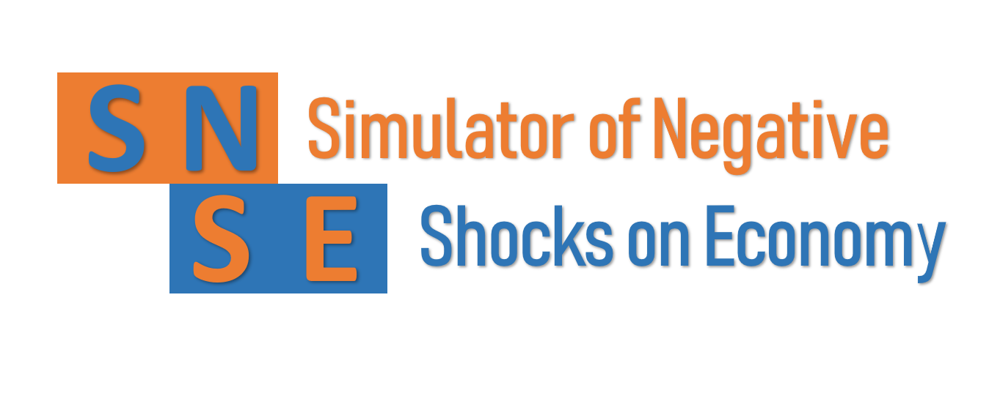
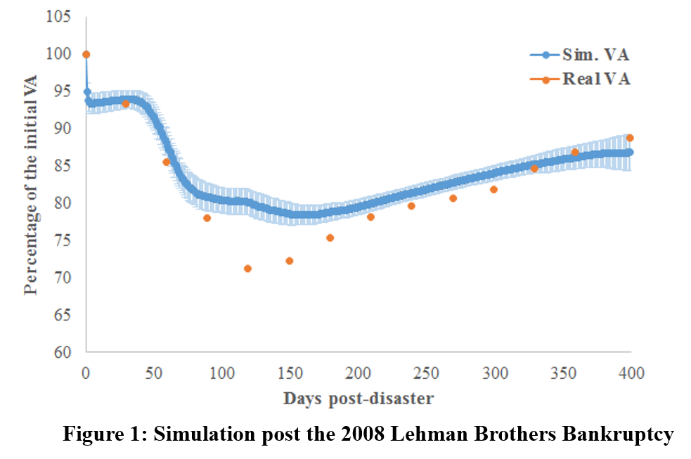
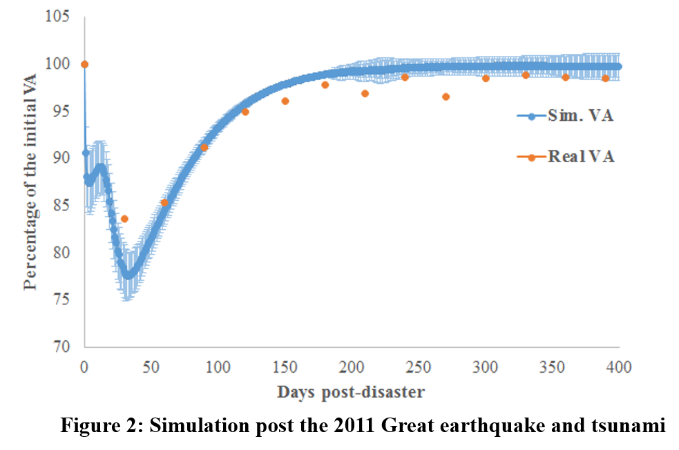

# A model for indirect losses of negatives shocks in production and finance

This code simulates the propagation of negatives shocks through a supply chain network and a bank-firm credit network. The modelling of negatives shocks spread across the supply chain is based on the simulator of 
[Inoue and Todo (2018)](https://www.rieti.go.jp/jp/publications/dp/18e013.pdf) available on [Github](https://github.com/HiroyasuInoue/ProductionNetworkSimulator).

Moreover, the model simulates the effects of initial exoegouns negatives shocks on the supply chain, on the bank-firm credit network. The model simulates the non-performing loans and the liquidity crisis of banks following 
negatives shocks on the supply chain.

Based on real Japanese data, two negatives shocks were simulated: the 2008 Lehman brothers bankruptcy and the 2011 Great earthquake and tsunami. The model reproduces the real 1-year dynamics of the Index of Industrial Production (IIP) of
 the Japanese economy as shown in these figures from [Krichene et al. (2019)](https://papers.ssrn.com/sol3/papers.cfm?abstract_id=3343949).

  

# 1. Usage details of SNSE

The SNSE simulator is a ready to use code. However, the example given in this Github repo is for windows 64bit users. 

* Download the release of this [link](https://github.com/hazem2410/SNSE/releases/tag/First).
* Uncompress the file .rar
* Open windows command line and execute ABM_Disasters.exe.

The user will obtain the same results shown in "Results" directory of this repo. The simulation is based on toy data.
You can use the model on any data; replace the toy data by your real data.

# 2. Parameters of the SNSE

The parameters should reflect the properties of your economy: How firms and banks behave? In our work in [Krichene et al. (2019)](https://papers.ssrn.com/sol3/papers.cfm?abstract_id=3343949) we used a Latin hypercube sampling
to calibrate our parameters and reproduced the IIP dynamics shown in Figures 1&2. The user may define any different approach. In this section we explain the meaning and roles of each parameter in the SNSE.

Two types of parameters are in the SNSE: behavioral parameters and simulation parameters. The first are used to define the strategies of agents. The latters are used to define different scenarios of the simulation.

### Behavioral parameters

* n: the number of days of the inventory.
* GammaMin, GammaMax: the recovery speed of damaged firms.
* LimitSolvencyRatio: the acceptable solvency by banks to supply loans.
* LoanMaturity, LTLoanMaturity: maturity of short and long term loans.
* DamageMagnitude: the magnitude of the initial negative shock to the supply chain.
* NumberDamagedFirms: the number of initial damaged firms.

### Simulation parameters

* t: simulation time, assumed to be one day: daily simulation.
* disaster: if 0 no negative shock; if 1 simulation of negative shock at t = 1.
* WithPayment: if 0, the SNSE simulates [Inoue and Todo (2018)](https://github.com/HiroyasuInoue/ProductionNetworkSimulator); if 1, the SNSE considers the bank-firm network.
* HelpFirms: if 0, firms can get funding only as loans from banks; if 1, firms may have an exogenous funding.
* BankRiskManager: if 0, banks supply loans to all received demand; if 1, banks monitor their risk based on the LimitSolvencyRatio parameter.

# 3. Outputs of the SNSE

Example of outputs are given in the Results directory of this repo.

* DamagedFirms.txt: list of initially damaged firms.
* FinalGvtSupport.txt: the amount of exogenous funding.
* FinalLiquidity.txt: the liquidity ratio of banks.
* FinalNPL.txt: the generated non-performing loans.
* GDP.txt: the dynamics of the simulated VA, used as a proxy of IIP.

# 4. References based on the SNSE

Krichene, H., Inoue, H., Isogai, T., Chakraborty, A. A model for indirect losses of negatives shocks in production and finance, (2019). [SSRN](https://papers.ssrn.com/sol3/papers.cfm?abstract_id=3343949).