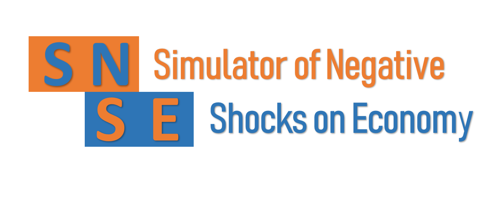

# A model for indirect losses of negatives shocks in production and finance

This code simulates the propagation of negatives shocks through a supply chain network and a bank-firm credit network. The modelling of negatives shocks spread across the supply chain is based on the simulator of 
[Inoue and Todo (2018)](https://www.rieti.go.jp/jp/publications/dp/18e013.pdf) available on [Github](https://github.com/HiroyasuInoue/ProductionNetworkSimulator).

Moreover, the model simulates the effects of initial exoegouns negatives shocks on the supply chain, on the bank-firm credit network. The model simulates the non-performing loans and the liquidity crisis of banks following 
negatives shocks on the supply chain.

Based on real Japanese data, two negatives shocks were simulated: the 2008 Lehman brothers bankruptcy and the 2011 Great earthquake and tsunami. The model reproduces the real 1-year dynamics of the Index of Industrial Production of
 the Japanese economy as shown in these figures.

  

    
  

  

    
  

# 1. Usage details of SNSE

